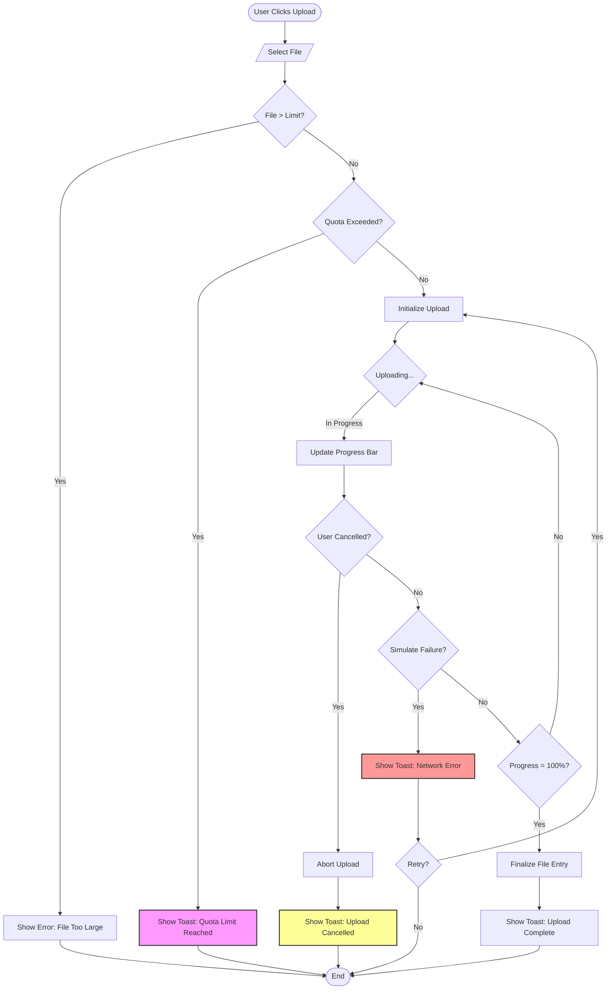

# System Workflow Diagrams

## 1. Student Upload Flow
This diagram illustrates the process of uploading a large file, including logic for quota enforcement, user cancellation, and error handling.

```mermaid
flowchart TD
    Start([User Clicks Upload]) --> SelectFile[/Select File/]
    SelectFile --> CheckSize{File > Limit?}
    
    CheckSize -- Yes --> ErrorSize[Show Error: File Too Large]
    ErrorSize --> End([End])
    
    CheckSize -- No --> CheckQuota{Quota Exceeded?}
    
    CheckQuota -- Yes --> WarningQuota[Show Toast: Quota Limit Reached]
    WarningQuota --> End
    
    CheckQuota -- No --> InitUpload[Initialize Upload]
    InitUpload --> UploadLoop{Uploading...}
    
    UploadLoop -- In Progress --> ShowProgress[Update Progress Bar]
    ShowProgress --> CheckCancel{User Cancelled?}
    
    CheckCancel -- Yes --> CancelAction[Abort Upload]
    CancelAction --> ToastCancel[Show Toast: Upload Cancelled]
    ToastCancel --> End
    
    CheckCancel -- No --> SimFail{Simulate Failure?}
    
    SimFail -- Yes --> ErrorNet[Show Toast: Network Error]
    ErrorNet --> RetryOption{Retry?}
    RetryOption -- Yes --> InitUpload
    RetryOption -- No --> End
    
    SimFail -- No --> CheckDone{Progress = 100%?}
    
    CheckDone -- No --> UploadLoop
    CheckDone -- Yes --> SuccessAction[Finalize File Entry]
    SuccessAction --> ToastSuccess[Show Toast: Upload Complete]
    ToastSuccess --> End
    
    style WarningQuota fill:#f9f,stroke:#333,stroke-width:2px
    style ToastCancel fill:#ff9,stroke:#333,stroke-width:2px
    style ErrorNet fill:#f99,stroke:#333,stroke-width:2px
```
